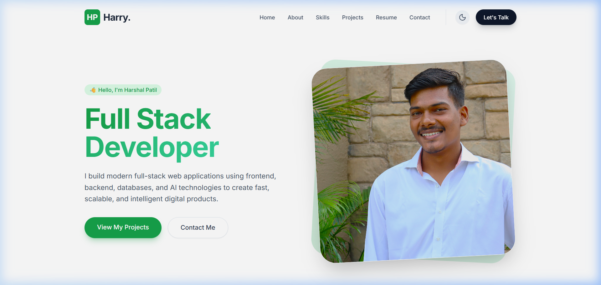
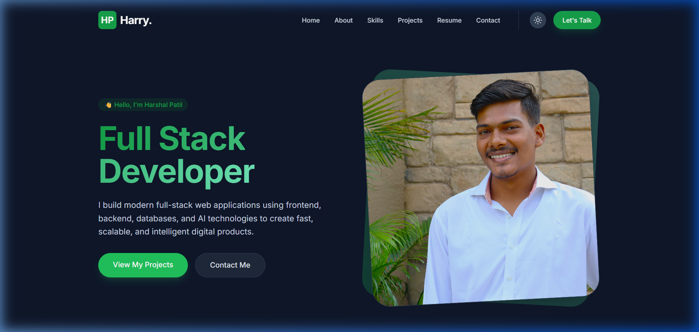

# 🚀 Harshal Patil - Full Stack Developer Portfolio

Welcome to the source code repository for my personal developer portfolio website. This project is a modern, high-performance, responsive single-page application (SPA) built using React, TypeScript, Tailwind CSS, and Framer Motion for smooth micro-interactions.

website link :

---

## 🎨 Design Preview

Here is a visual showcase of the portfolio interface in both light and dark themes:

### Light Mode


### Dark Mode


---

## ✨ Key Features

- **🌓 Dual Theme Support:** Seamless toggle between Light and Dark modes, with user preferences automatically persisted in `localStorage`.
- **✨ Smooth Micro-Animations:** Implemented fluid entry animations, hover transitions, and viewport-triggered animations using `framer-motion`.
- **📱 Fully Responsive Layout:** Designed from the ground up for all screen sizes, from mobile phones to high-resolution desktop monitors.
- **🛠️ Dedicated Sections:**
  - **Hero:** Eye-catching greeting, professional title, profile picture, and CTA buttons.
  - **About:** Personal backstory, stats card (Experience, Projects, Clients), and core skills breakdown.
  - **Services:** Detailed overview of services offered (Frontend, Backend, Design, Mobile).
  - **Portfolio:** Interactive grid of projects with hover cards displaying details and direct links.
  - **Resume:** Work and education history mapped onto an elegant timeline.
  - **Contact:** Clean contact form with integrated client-side state handling and validation.

---

## ⚙️ Tech Stack & Dependencies

- **Core Framework:** [React 19](https://react.dev/)
- **Build Tool:** [Vite](https://vite.dev/)
- **Programming Language:** [TypeScript](https://www.typescriptlang.org/)
- **Styling:** [Tailwind CSS v3](https://tailwindcss.com/)
- **Animations:** [Framer Motion](https://www.framer.com/motion/)
- **Icons:** [Lucide React](https://lucide.dev/)

---

## 🛠️ Step-by-Step Setup Process

Follow these steps to run the project locally or build it for production:

### 1. Prerequisites
Ensure you have [Node.js](https://nodejs.org/) installed (version 18+ is recommended).

### 2. Clone the Repository
Clone this repository to your local system:
```bash
git clone <repository-url>
cd portfolio
```

### 3. Install Dependencies
Run the package manager command to download and install all necessary dependencies:
```bash
npm install
```

### 4. Run the Development Server
Launch the local development server with Hot Module Replacement (HMR):
```bash
npm run dev
```
By default, the application will be available at **`http://localhost:5173/`**.

### 5. Build for Production
To compile and bundle the portfolio with optimal assets minification for hosting:
```bash
npm run build
```
The output files will be generated in the **`dist/`** directory.

### 6. Preview the Production Build
Test the build output locally before deployment:
```bash
npm run preview
```

---

## 📦 Deployment Instructions

The production folder (`dist/`) can be deployed to any static site hosting service:

- **Vercel / Netlify:** Connect your GitHub repository and set the build command to `npm run build` and publish directory to `dist`.
- **GitHub Pages:** You can use the `gh-pages` npm package or set up a GitHub Actions workflow to deploy automatically on pushes to the `main` branch.